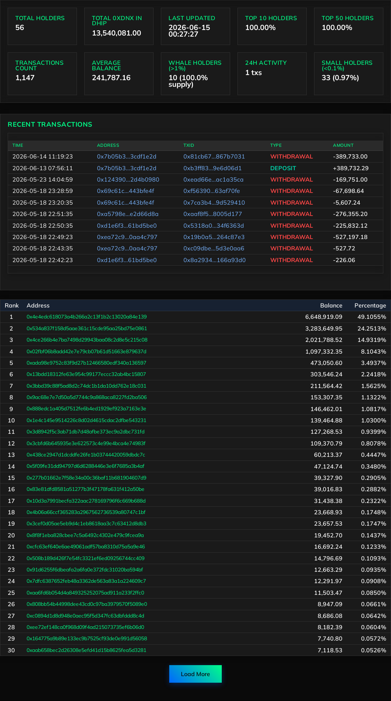
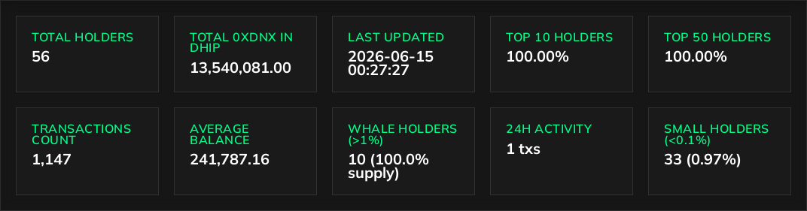
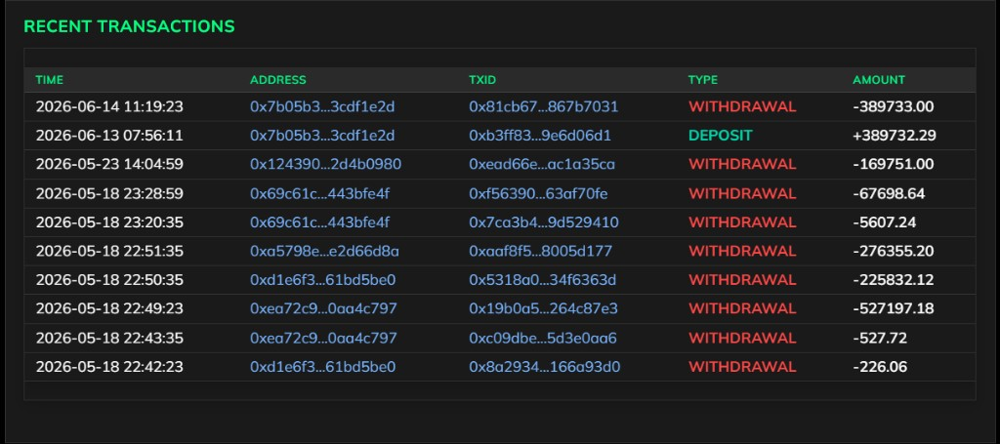
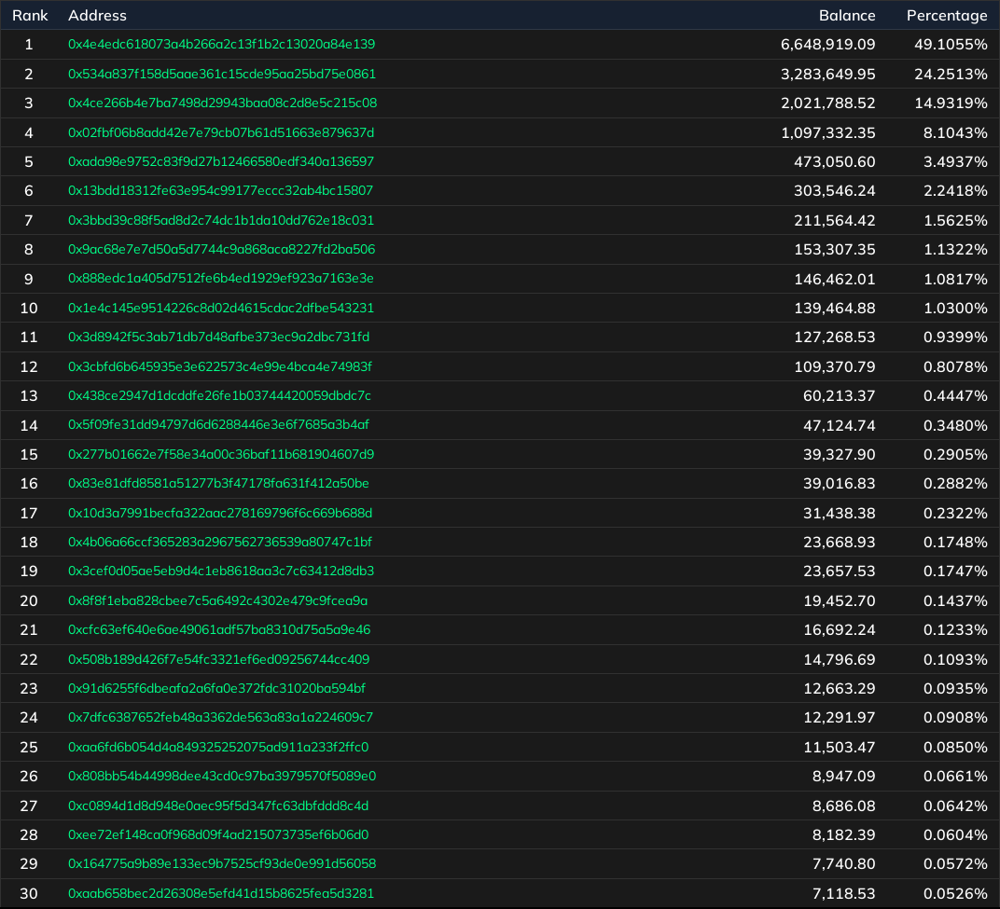
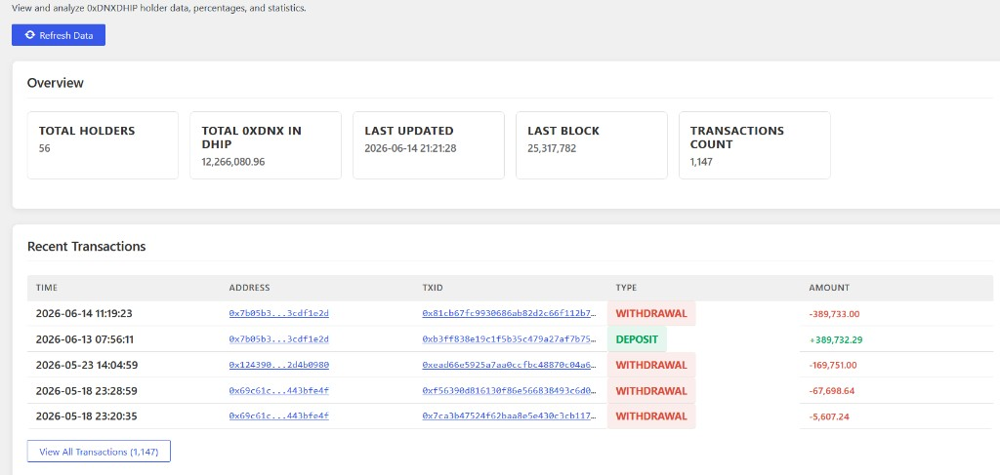
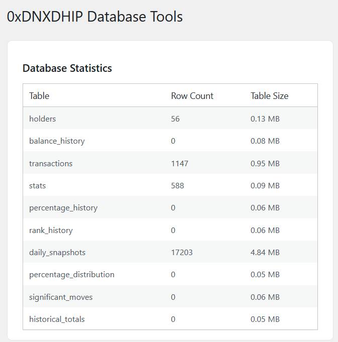
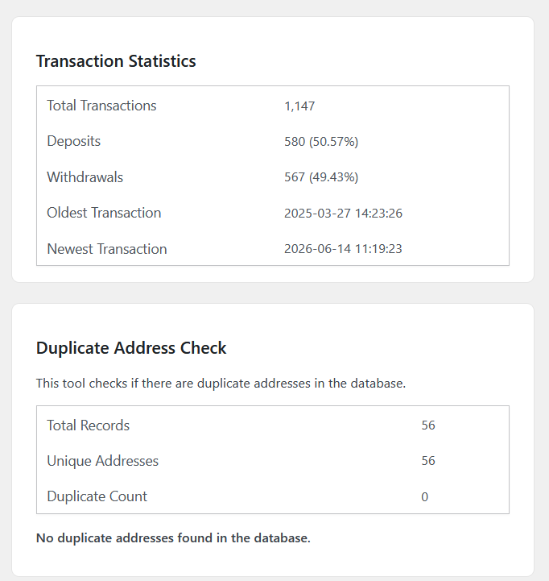
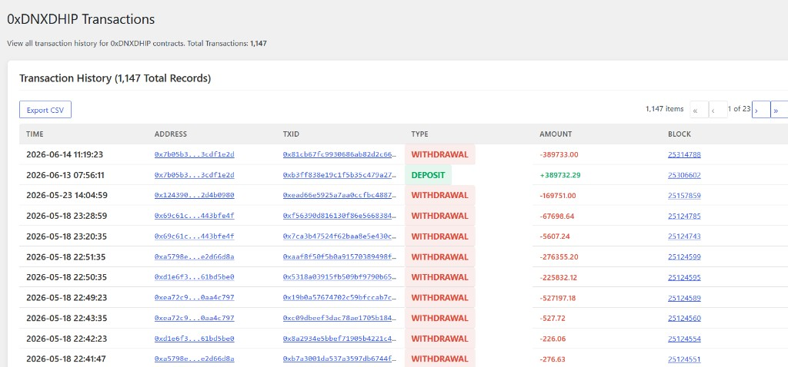

# 0xDNX DHIP Richlist — WordPress plugin

**Live holder rankings** for Wrapped Dynex (0xDNX) in the DHIP v2 pool on Ethereum — who holds how much, what share of the pool they represent, and what moved recently. Holders, researchers, and community members use [logicencoder.com/0xdnx-dhip-v2-richlist/](https://logicencoder.com/0xdnx-dhip-v2-richlist/) to track concentration and whale activity without running an indexer or parsing explorer pages line by line.

## Tech stack

| Layer | Technologies |
|-------|--------------|
| WordPress plugin | PHP (single-file ~4.9k LOC), shortcodes, wp-admin UI, WordPress AJAX, WordPress REST API |
| Public UI | HTML, CSS (Mulish, dark theme), JavaScript (live refresh, load-more, nonce handling) |
| WordPress database | MySQL — custom tables for holders, stats, transactions, daily snapshots |
| Chain indexer | Python 3, web3.py, requests, sqlite3, orjson, threading/queue workers |
| Ingest | Authenticated REST push (X-API-Key), balance/percentage math in Python before persist |
| SEO | Static snapshot HTML, JSON-LD structured data, bot vs human user-agent routing |
| Caching | LiteSpeed-friendly no-cache on live poll routes; snapshot files for crawlers |
| Networking | Cloudflare tunnel, Ethereum JSON-RPC, Etherscan links |
| Hosting | WordPress on shared hosting; Python indexer on self-hosted Linux server |

## Summary statistics

Above the table, a **stats band** shows pool totals — holder count, aggregate 0xDNX in DHIP, top-holder concentration metrics, whale counts, and **24h deposit/withdraw activity**. Percentages in the table are easier to read when the denominator is visible in the same glance.

## Recent transactions

A **recent activity panel** lists deposits and withdrawals: time, direction, addresses, amount, and transaction links. Rankings show *state*; this panel shows *what changed* — large entries, new wallets, exits.

## Ranked holder table

The main view is a **ranked table**: position, address (truncated, linked to Etherscan), formatted balance, and **exact percentage of total 0xDNX in the pool**. Default page size is configurable (typically 30 rows); **Load more** fetches the next ranks without reloading the page. The table auto-refreshes on an interval so rankings stay current during active trading days.

## Live page and search engines

Human visitors load the interactive UI via AJAX — stats refresh, pagination, and timed polling. Crawlers and AI summaries can receive **pre-rendered snapshot HTML** plus JSON-LD so rankings and headline stats appear in search and answer engines without executing the live poll loop.

Shortcode **`[0xdnxdhip_richlist]`** embeds stats, table, transactions, and refresh behaviour on any WordPress page.

## WordPress admin

Top-level **0xDNXDHIP** menu in wp-admin — operators manage display, data, and exports without editing PHP.

### Admin dashboard

Headline stats, **Refresh Data**, and a preview of recent transactions with a link to the full history.

### Database tools

Per-table row counts and sizes across holders, transactions, stats, daily snapshots, and history tables.

### Database maintenance

Deposit vs withdrawal breakdown, transaction date range, and **duplicate address check** to confirm holder rows are unique.

### Transaction browser

Paginated full history with **Export CSV**, Etherscan-linked addresses and txids, and deposit/withdraw badges.

Private code: [dynex-0xdnx-dhip-richlist-plugin](https://github.com/logicencoder/dynex-0xdnx-dhip-richlist-plugin) · indexer [dynex-0xdnx-dhip-richlist-monitor](https://github.com/logicencoder/dynex-0xdnx-dhip-richlist-monitor)

Guide: [Wrapped Dynex richlist explained](https://logicencoder.com/wrapped-dynex-richlist-0xdnx-dvhip-v2/)

See [REPOS.md](REPOS.md).

---

**Made by [Logic Encoder](https://logicencoder.com)** · [GitHub](https://github.com/logicencoder) · [Contact](https://logicencoder.com/contact/)
